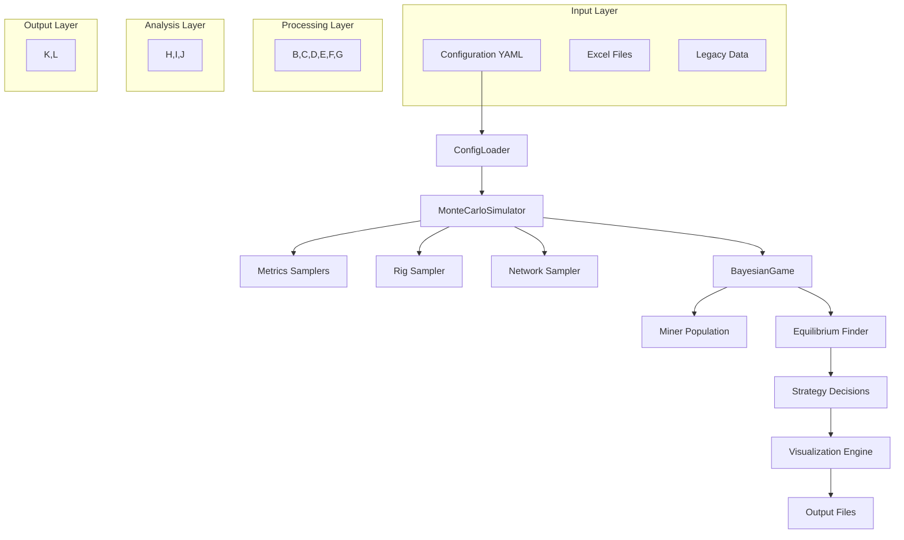
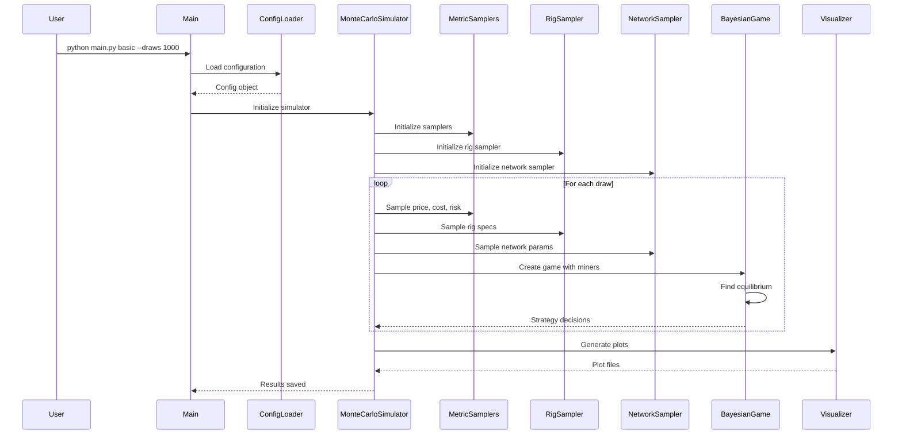

# Bayesian Monte Carlo Simulation for Bitcoin Mining Game Theory

## Overview

This system implements a comprehensive Bayesian Monte Carlo simulation framework for analyzing strategic decision-making in Bitcoin mining economics. The simulation models miners' choices between solo mining, pool mining, and staying offline based on game theory principles, incorporating uncertainty in market conditions, costs, and risk preferences.

## Table of Contents

1. [Architecture Overview](#architecture-overview)
2. [Input Sources](#input-sources)
3. [Data Flow](#data-flow)
4. [Core Components](#core-components)
5. [Packages and Dependencies](#packages-and-dependencies)
6. [Configuration System](#configuration-system)
7. [Simulation Engine](#simulation-engine)
8. [Game Theory Implementation](#game-theory-implementation)
9. [Metrics and Sampling](#metrics-and-sampling)
10. [Visualization System](#visualization-system)
11. [Output Formats](#output-formats)
12. [Usage Examples](#usage-examples)
13. [API Reference](#api-reference)

## Architecture Overview



The system follows a modular, layered architecture with clear separation of concerns:

- **Input Layer**: Configuration files and legacy data sources
- **Processing Layer**: Samplers, simulators, and game logic
- **Analysis Layer**: Equilibrium finding and strategy optimization
- **Output Layer**: Visualization and data export

## Input Sources

### Configuration Files

**Primary Configuration**: `config/default.yaml`
```yaml
simulation:
  draws: 1000          # Number of Monte Carlo draws
  miners: 500          # Miners per simulation
  max_iterations: 10   # Max equilibrium iterations

metrics:
  price:
    type: lognormal    # BTC price distribution
    mean: 119000       # Mean price ($)
    sigma: 0.4         # Price volatility
  cost:
    type: empirical_excel
    file: "data/cost_rates.xlsx"
  risk:
    type: uniform
    low: 0.0
    high: 1.0

network:
  hash_rate: 990000000  # Network hash rate (TH/s)
  pool_fee: 0.025       # Pool fee (2.5%)
  block_time: 600       # Block time (seconds)
  discount_factor: 0.5  # Time discount factor
```

### Excel Data Files

1. **Cost Rates**: `data/cost_rates.xlsx`
   - Electricity cost rates by region ($/kWh)
   - Historical cost data for empirical sampling

2. **Rig Specifications**: `data/rig_specs.xlsx`
   - Mining hardware specifications
   - Hash rate capacity and efficiency metrics
   - Power consumption data

### Legacy Code Integration

The system maintains compatibility with legacy simulation code in the `legacy/` directory:
- `monte_carlo.py`: Original single-scenario simulation
- `factorial_monte_carlo.py`: Multi-context analysis
- `generate_excel.py`: Data processing utilities

**Note**: Excel data files (`cost_rates.xlsx`, `rig_specs.xlsx`) have been moved to the `data/` directory for better organization.

## Data Flow



### Detailed Flow Steps:

1. **Initialization Phase**
   - Load YAML configuration
   - Initialize all samplers (price, cost, risk, rig, network)
   - Create simulation engine

2. **Per-Draw Processing**
   - Sample market conditions (BTC price)
   - Sample miner characteristics (costs, risk preferences, hardware)
   - Sample network parameters (hash rate, fees, block times)
   - Create population of heterogeneous miners
   - Execute Bayesian game to find equilibrium strategies

3. **Equilibrium Finding**
   - Initialize with random strategies
   - Calculate expected utilities for each strategy
   - Update strategies based on best responses
   - Iterate until convergence or max iterations

4. **Result Aggregation**
   - Collect strategy distributions across draws
   - Calculate summary statistics
   - Generate visualizations

## Core Components

### Configuration System (`config/`)

**ConfigLoader** (`config/loader.py`)
- Loads and validates YAML configuration
- Converts config to Python dataclasses
- Provides type-safe configuration access

**Configuration Structure**:
```python
@dataclass
class Config:
    simulation: SimulationConfig
    metrics: MetricsConfig
    network: NetworkConfig
    game: GameConfig
    visualization: VisualizationConfig
    factorial: FactorialConfig
```

### Simulation Engine (`simulation/`)

**MonteCarloSimulator** (`simulation/base_simulator.py`)
- Main simulation orchestrator
- Manages multiple Monte Carlo draws
- Coordinates sampling and game execution

**FactorialMonteCarlo** (`simulation/factorial.py`)
- Extends base simulator for multi-context analysis
- Tests scenarios across different market conditions
- Generates comparative results

### Game Theory Implementation (`game/`)

**BayesianGame** (`game/bayes_game.py`)
- Implements Bayesian game framework
- Manages miner population and strategy choices
- Finds Nash equilibrium through best-response iteration

**MinerType** (`game/miner.py`)
- Represents individual miner characteristics
- Calculates expected utilities for each strategy
- Makes strategy decisions based on game state

**Strategy Classes** (`game/strategy.py`)
- `SoloMining`: Independent mining strategy
- `PoolMining`: Collaborative mining strategy
- `Offline`: No mining strategy
- `UtilityMaximizing`: Optimal strategy selection

### Metrics and Sampling (`metrics/` + `sampler/`)

**PriceSampler** (`metrics/price.py`)
- Samples BTC price from lognormal distribution
- Configurable mean and volatility parameters

**CostSampler** (`metrics/cost.py`)
- Samples electricity costs
- Supports empirical (Excel) and uniform distributions

**RiskSampler** (`metrics/risk.py`)
- Samples miner risk aversion (0-1 scale)
- Supports uniform and beta distributions

**RigSampler** (`sampler/rig.py`)
- Samples mining hardware specifications
- Loads data from Excel files

**NetworkSampler** (`sampler/network.py`)
- Samples network-level parameters
- Hash rate, fees, block times, rewards

## Packages and Dependencies

### Core Dependencies

```python
# Data processing and analysis
numpy>=1.21.0          # Numerical computing
pandas>=1.3.0          # Data manipulation
scipy>=1.7.0           # Statistical functions

# Configuration and serialization
pyyaml>=6.0            # YAML parsing
dataclasses>=0.6       # Python 3.7+ built-in

# Visualization
matplotlib>=3.4.0      # Plotting library
seaborn>=0.11.0        # Statistical visualization
plotly>=5.0.0          # Interactive plots

# Excel file processing
openpyxl>=3.0.0        # Excel file reading
xlrd>=2.0.0            # Legacy Excel support
```

### Development Dependencies

```python
pytest>=6.0.0          # Testing framework
black>=21.0.0          # Code formatting
mypy>=0.900            # Type checking
flake8>=4.0.0          # Linting
```

### Optional Dependencies

```python
jupyter>=1.0.0         # Interactive development
notebook>=6.0.0        # Jupyter notebook support
```

## Configuration System

### YAML Configuration Structure

The system uses a hierarchical YAML configuration with the following main sections:

#### Simulation Parameters
```yaml
simulation:
  draws: 1000              # Number of Monte Carlo draws
  miners: 500              # Miners per simulation
  max_iterations: 10       # Max equilibrium iterations
```

#### Metrics Configuration
```yaml
metrics:
  price:
    type: lognormal        # Distribution type
    mean: 119000           # Mean BTC price ($)
    sigma: 0.4             # Volatility parameter
  cost:
    type: empirical_excel  # Sampling method
    file: "legacy/cost_rates.xlsx"
  risk:
    type: uniform          # Distribution type
    low: 0.0               # Minimum risk aversion
    high: 1.0              # Maximum risk aversion
```

#### Network Parameters
```yaml
network:
  hash_rate: 990000000     # Network hash rate (TH/s)
  pool_fee: 0.025          # Pool fee (2.5%)
  block_time: 600          # Average block time (seconds)
  block_reward: 3.125      # Block reward (BTC)
  block_subsidy: 0.035     # Block subsidy (BTC)
  discount_factor: 0.5     # Time discount factor
```

#### Factorial Analysis
```yaml
factorial:
  contexts:
    good:                  # Bull market scenario
      price: 200000
      network_hash: 400000000
      block_subsidy: 0.05
    average:               # Base case scenario
      price: 120000
      network_hash: 600000000
      block_subsidy: 0.025
    bad:                   # Bear market scenario
      price: 60000
      network_hash: 1000000000
      block_subsidy: 0.01
```

## Simulation Engine

### Monte Carlo Process

The simulation follows this algorithm:

```python
for draw in range(n_draws):
    # 1. Sample market conditions
    btc_price = price_sampler.sample()

    # 2. Create miner population
    miners = []
    for i in range(n_miners):
        cost = cost_sampler.sample()
        risk = risk_sampler.sample()
        capacity, efficiency = rig_sampler.sample()
        n_rigs = random.randint(1, 10)
        total_hash = capacity * n_rigs

        miner = MinerType(cost, efficiency, risk, total_hash)
        miners.append(miner)

    # 3. Sample network parameters
    network_hash = network_sampler.sample_total_hash()
    pool_fee = network_sampler.sample_pool_fee()
    block_reward = network_sampler.sample_block_reward(btc_price)

    # 4. Execute Bayesian game
    game = BayesianGame(network_sampler)
    game.add_miners(miners)
    game.update_game_state(btc_price)

    # 5. Find equilibrium
    converged = game.find_equilibrium(max_iterations)

    # 6. Record results
    results.append(game.get_summary())
```

### Equilibrium Finding Algorithm

The Bayesian game finds Nash equilibrium using best-response dynamics:

```python
def find_equilibrium(self, max_iterations):
    converged = False
    for iteration in range(max_iterations):
        old_strategies = [m.strategy for m in self.miners]

        # Update each miner's strategy
        for miner in self.miners:
            best_strategy = miner.choose_best_strategy()
            miner.strategy = best_strategy

        # Check convergence
        new_strategies = [m.strategy for m in self.miners]
        if old_strategies == new_strategies:
            converged = True
            break

    return converged
```

## Game Theory Implementation

### Miner Utility Functions

Each miner maximizes expected utility considering:

1. **Revenue**: Expected BTC earnings
2. **Costs**: Electricity and operational expenses
3. **Risk**: Variance in earnings (risk-averse miners penalize volatility)

#### Solo Mining Utility
```python
def utility_solo(miner):
    expected_blocks = (miner.hash_rate / network_hash) * blocks_per_day
    revenue = expected_blocks * block_reward * btc_price
    cost = miner.cost_per_day()
    variance_penalty = risk_aversion * revenue_variance
    return revenue - cost - variance_penalty
```

#### Pool Mining Utility
```python
def utility_pool(miner):
    pool_share = miner.hash_rate / pool_hash
    expected_blocks = (pool_hash / network_hash) * blocks_per_day
    revenue = expected_blocks * pool_share * block_reward * btc_price * (1 - pool_fee)
    cost = miner.cost_per_day()
    variance_penalty = risk_aversion * revenue_variance_pool
    return revenue - cost - variance_penalty
```

### Strategy Decision Logic

Miners choose strategies based on maximum expected utility:

```python
def choose_strategy(miner):
    u_solo = calculate_utility_solo(miner)
    u_pool = calculate_utility_pool(miner)
    u_offline = 0  # No revenue, no cost

    utilities = {
        'solo': u_solo,
        'pool': u_pool,
        'offline': u_offline
    }

    return max(utilities, key=utilities.get)
```

## Metrics and Sampling

### Price Sampling

**Lognormal Distribution**:
```python
def sample_price(self):
    # Log-normal: exp(μ + σ * Z) where Z ~ N(0,1)
    log_price = self.mu + self.sigma * np.random.normal()
    return np.exp(log_price)
```

**Parameters**:
- `mu`: Mean of log price (log(119000) ≈ 11.69)
- `sigma`: Volatility parameter (0.4)

### Cost Sampling

**Empirical Distribution**:
```python
def sample_cost(self):
    # Load historical cost data from Excel
    costs = pd.read_excel(self.file_path)
    return np.random.choice(costs['cost_per_kwh'])
```

**Uniform Distribution** (fallback):
```python
def sample_cost_uniform(self):
    return np.random.uniform(self.low, self.high)
```

### Risk Sampling

**Uniform Distribution**:
```python
def sample_risk(self):
    return np.random.uniform(0.0, 1.0)
```

**Beta Distribution** (alternative):
```python
def sample_risk_beta(self):
    return np.random.beta(self.alpha, self.beta)
```

## Visualization System

### Plot Types

1. **Scatter Plots** (`visualization/scatter.py`)
   - Cost vs. hash rate by strategy
   - Risk vs. profitability
   - Size-coded by risk aversion

2. **Distribution Plots** (`visualization/distribution.py`)
   - Strategy distribution histograms
   - Price distribution analysis
   - Cost distribution analysis

3. **Violin Plots** (`visualization/violin.py`)
   - Strategy distribution by cost ranges
   - Risk distribution by strategy
   - Comparative analysis across scenarios

### Color Scheme

```python
colors = {
    'solo': '#a8dadc',     # Light blue
    'pool': '#ffb4a2',     # Light coral
    'offline': '#e9c46a'   # Light yellow
}
```

## Output Formats

### CSV Files

**Summary Results** (`simulation_summary.csv`):
```csv
draw_idx,btc_price,converged,total_miners,active_miners,pct_active,total_hash_rate,pool_hash_rate,pct_solo,pct_pool,pct_offline
0,125000.50,true,500,387,0.774,45000000,15000000,0.45,0.32,0.23
1,98000.25,true,500,412,0.824,52000000,18000000,0.38,0.44,0.18
...
```

**Individual Miner Data** (`simulation_miners.csv`):
```csv
draw_idx,miner_id,cost_per_kwh,efficiency,risk_aversion,max_hash_rate,strategy,actual_hash_rate,revenue,cost,profit
0,0,0.08,45.2,0.3,100.5,solo,100.5,1250.50,864.00,386.50
0,1,0.12,38.7,0.7,75.2,pool,75.2,890.25,648.00,242.25
...
```

### Plot Files

- `scatter_cost_hash.png`: Cost vs hash rate scatter plot
- `distribution_strategies.png`: Strategy distribution histogram
- `violin_risk_strategy.png`: Risk distribution by strategy
- Interactive HTML plots (Plotly)

### Metadata Files

**JSON Metadata** (`simulation_metadata.json`):
```json
{
  "config": {
    "draws": 1000,
    "miners_per_draw": 500,
    "pool_hash_override": null
  },
  "samplers": {
    "price": "Lognormal distribution (mu=11.69, sigma=0.4)",
    "cost": "Empirical from data/cost_rates.xlsx",
    "risk": "Uniform distribution (0.0, 1.0)",
    "rig": "Empirical from data/rig_specs.xlsx",
    "network": "Fixed parameters with sampling"
  },
  "timestamp": "2025-09-12T16:27:05",
  "execution_time": "45.2s"
}
```

## Usage Examples

### Basic Simulation

```bash
# Run basic Monte Carlo simulation with 1000 draws
python main.py basic --draws 1000

# Run with custom pool hash rate
python main.py basic --draws 500 --pool-hash 50000000

# Record individual miner data
python main.py basic --draws 100 --record-miners

# Generate plots
python main.py basic --draws 1000 --generate-plots
```

### Factorial Analysis

```bash
# Run factorial analysis across market contexts
python main.py factorial --draws 500

# Custom draws per context
python main.py factorial --draws 200
```

### Configuration Override

```bash
# Use custom configuration file
python main.py --config my_config.yaml basic --draws 1000

# Set logging level
python main.py --log-level DEBUG basic --draws 100

# Save logs to file
python main.py --log-file simulation.log basic --draws 1000
```

## API Reference

### MonteCarloSimulator

```python
class MonteCarloSimulator:
    def __init__(self, config: Config)
    def run(self, draws: int = None,
           pool_hash_override: float = None,
           record_miners: bool = False) -> SimulationResult
    def run_single(self, n_miners: int = None,
                  pool_hash_override: float = None) -> pd.DataFrame
```

### BayesianGame

```python
class BayesianGame:
    def __init__(self, network_sampler, strategy: Strategy = None)
    def add_miner(self, miner: MinerType)
    def add_miners(self, miners: List[MinerType])
    def update_game_state(self, btc_price: float,
                         pool_hash_override: float = None)
    def find_equilibrium(self, max_iterations: int) -> bool
    def to_dataframe(self) -> pd.DataFrame
```

### MinerType

```python
@dataclass
class MinerType:
    cost_per_kwh: float
    efficiency: float
    risk_aversion: float
    max_hash_rate: float

    def cost_per_day(self) -> float
    def revenue_solo(self) -> float
    def revenue_pool(self) -> float
    def choose_best_strategy(self) -> str
```

### Metric Samplers

```python
class PriceSampler(MetricSampler):
    def sample(self) -> float
    def get_description(self) -> str

class CostSampler(MetricSampler):
    def sample(self) -> float
    def get_description(self) -> str

class RiskSampler(MetricSampler):
    def sample(self) -> float
    def get_description(self) -> str
```

## Performance Considerations

### Memory Usage
- Individual miner data: ~500 bytes per miner
- 1000 draws × 500 miners = ~500MB for full data
- Use `--record-miners` only when needed

### Execution Time
- Single draw: ~50-100ms
- 1000 draws: ~1-2 minutes
- Factorial analysis: ~5-10 minutes

### Optimization Strategies
- Vectorized calculations using NumPy
- Efficient equilibrium convergence
- Lazy loading of Excel data
- Parallel processing potential

## Troubleshooting

### Common Issues

1. **Configuration Errors**
   ```
   ERROR: Configuration file not found
   SOLUTION: Check config/default.yaml exists
   ```

2. **Excel File Errors**
   ```
   ERROR: Excel file not found
   SOLUTION: Verify data/ directory and Excel files exist
   ```

3. **Memory Issues**
   ```
   ERROR: Out of memory
   SOLUTION: Reduce --draws or disable --record-miners
   ```

4. **Convergence Issues**
   ```
   WARNING: Equilibrium not converged
   SOLUTION: Increase max_iterations in config
   ```

### Debug Mode

```bash
# Enable debug logging
python main.py --log-level DEBUG basic --draws 10

# Save debug logs
python main.py --log-level DEBUG --log-file debug.log basic --draws 10
```

## Future Enhancements

### Planned Features
- Real-time market data integration
- Machine learning-based strategy prediction
- Web-based visualization dashboard
- Multi-asset mining simulation
- Network congestion modeling

### Extension Points
- Custom sampler implementations
- Alternative game theory models
- Additional visualization types
- Export to different formats

---

*This documentation covers the Bayesian Monte Carlo simulation system for Bitcoin mining game theory analysis. The system provides a comprehensive framework for understanding miner behavior under uncertainty and market dynamics.*</content>
<parameter name="filePath">/Users/enricotedeschi/projects/bitcoin-mining-gametheory/data_and_scripts/enrico/bayesian_montecarlo/docs/README.md