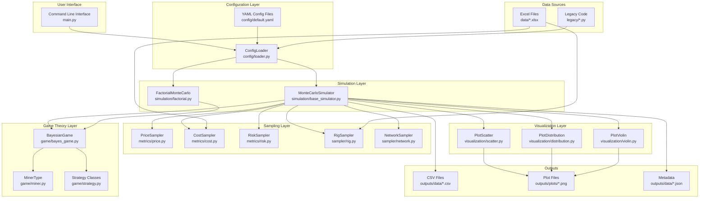
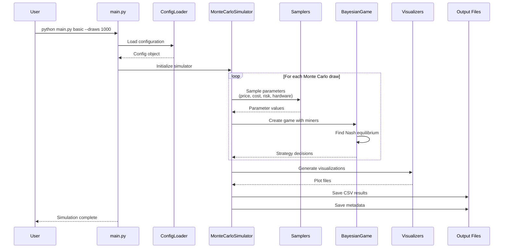
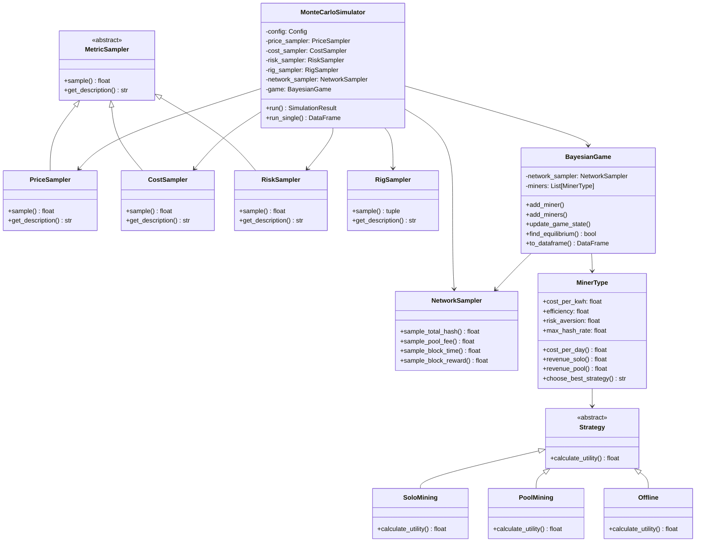

# Architecture Diagrams

## System Architecture



## Data Flow Diagram



## Class Hierarchy



## Component Interaction Flow

```mermaid
flowchart TD
    A[Start Simulation] --> B{Load Configuration}
    B --> C[Initialize Samplers]
    C --> D[Create Miner Population]

    D --> E[Sample Market Conditions]
    E --> F[Sample Network Parameters]
    F --> G[Update Game State]

    G --> H{Find Equilibrium}
    H --> I{Converged?}
    I --> J[Update Strategies] --> H
    I --> K[Record Results]

    K --> L{More Draws?}
    L --> D
    L --> M[Aggregate Results]

    M --> N[Generate Visualizations]
    N --> O[Save Outputs]
    O --> P[End Simulation]
```</content>
<parameter name="filePath">/Users/enricotedeschi/projects/bitcoin-mining-gametheory/data_and_scripts/enrico/bayesian_montecarlo/docs/architecture.md